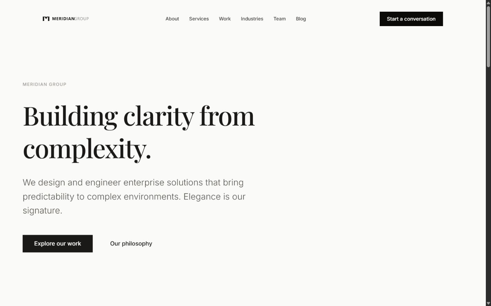
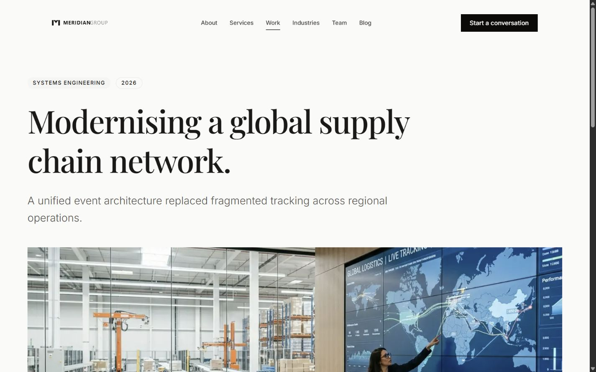

# Blueprint Corporate Editorial

## Overview
**Blueprint Corporate Editorial** is a production-ready HubZero Focused Blueprint designed for mature consulting, engineering, and digital transformation firms. Built on the rock-solid foundation of HubZero Blueprint Base, this template provides a sophisticated, narrative-driven identity that prioritizes typography, hierarchy, and a premium reading experience.

This repository is part of the **HubZero Blueprint** ecosystem. It contains a fictional demonstration website: "Meridian Group" does not exist, and every name, organization, product, testimonial, case study, and contact detail in this repository is fictional unless explicitly stated otherwise. The site exists to demonstrate production-quality engineering, design, accessibility, and information architecture, not to represent a real business.





## Features
- **Corporate Information Architecture:** Structured to guide enterprise clients from identity and mission down to specific disciplines and deep-dive case studies.
- **Editorial Design Language:** Prioritizes typography, whitespace, readable layouts, and restrained color usage over complex visual effects.
- **Responsive Layouts:** Fluidly scales across all device sizes.
- **SEO-ready:** Built-in semantic HTML and Next.js Metadata integration.
- **Accessibility:** High-contrast color palettes and semantic markup.
- **Reusable Components:** Features a cohesive set of UI primitives (Typography, Button, Card, Quote, Badge).
- **Configuration-driven Content:** Content is completely decoupled from presentation logic, making updates intuitive and safe.

## Included Pages
1. Home (`/`)
2. About (`/about`)
3. Services (`/services`)
4. Service Detail (`/services/[slug]`)
5. Work / Case Studies (`/work`)
6. Case Study Detail (`/work/[slug]`)
7. Industries (`/industries`)
8. Team (`/team`)
9. Careers (`/careers`)
10. Blog (`/blog`)
11. Blog Article (`/blog/[slug]`)
12. Contact (`/contact`)
13. Privacy Policy (`/privacy`)
14. Terms of Service (`/terms`)
15. 404 Not Found (`/_not-found`)

## Getting Started

### Installation
```bash
npm install
```

### Development
```bash
npm run dev
```

### Build
```bash
npm run build
```

### Verification
```bash
npm run lint
npm run typecheck
```

## Customization
This blueprint is designed for complete reusability. You can replace branding and content without ever touching the underlying reusable components.

- **Branding & Metadata:** Update `src/config/site.ts` to change the global site name, description, and URLs.
- **Navigation:** Modify `src/config/navigation.ts` to update header and footer routing.
- **Brand and imagery:** Replace assets in `public/brand/` and `public/images/placeholders/`, preserving the configured aspect ratios and focal intent.
- **Colors & Typography:** Adjust the Tailwind theme variables inside `src/app/globals.css` to inject your own brand colors and global typography.
- **Canonical content:** Update `src/config/content.ts`; index routes, detail routes, metadata, static parameters, and sitemap entries derive from these records.

## Placeholder Content
**Notice:** "Meridian Group" and all associated companies, people, testimonials, blog articles, and imagery are entirely fictional placeholder content. They are intended solely to demonstrate the blueprint's editorial design language and professional tone. Future projects should effortlessly overwrite these placeholders.

## Folder Structure
- `src/app/`: Next.js 16 App Router application routes and layouts.
- `src/components/layout/`: Foundational structural components (Page, Section, Container, Header, Footer).
- `src/components/ui/`: Reusable, styled UI primitives (Typography, Button, Card).
- `src/config/`: Centralized site configuration, metadata, and navigation.
- `src/config/content.ts`: Canonical service, industry, work, and editorial records.
- `public/images/placeholders/`: Fictional premium placeholder imagery.
- `public/brand/og-meridian.png`: Purpose-built 1200×630 social preview artwork.

## License
MIT
